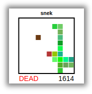

Hack-A-Day is a project I'm doing in November, where I try to make 30 new projects, in 30 days.

# Day 27: Hack-A-Snake

Day 27 is Snake. It's the same game as in [Hack-A-Minigame](https://tilde.za3k.com/hackaday/mini), just with keyboard controls.

Controls:
 - W/A/S/D or Up/Left/Down/Right to move
 - R to restart the game if you die

Demo available [here](https://tilde.za3k.com/hackaday/snake).

Source available on [github](https://github.com/za3k/day12_snake).
